# Library Management System

A modern web-based Library Management System built with Laravel that allows users to manage books, categories, and borrowing processes. The system implements role-based access control with admin and user roles.

## Access
to access the sql databse its simple go through database.sql copy and paste it to the phmyadmin and you are nice:3

## Features

- 📚 Book Management (CRUD)
- 📖 Category Management
- 🔄 Borrowing System
- 👥 User Management
- 📊 Dashboard with Statistics
- 🌙 Dark Mode Support
- 📱 Responsive Design

## Screenshots

### Authentication
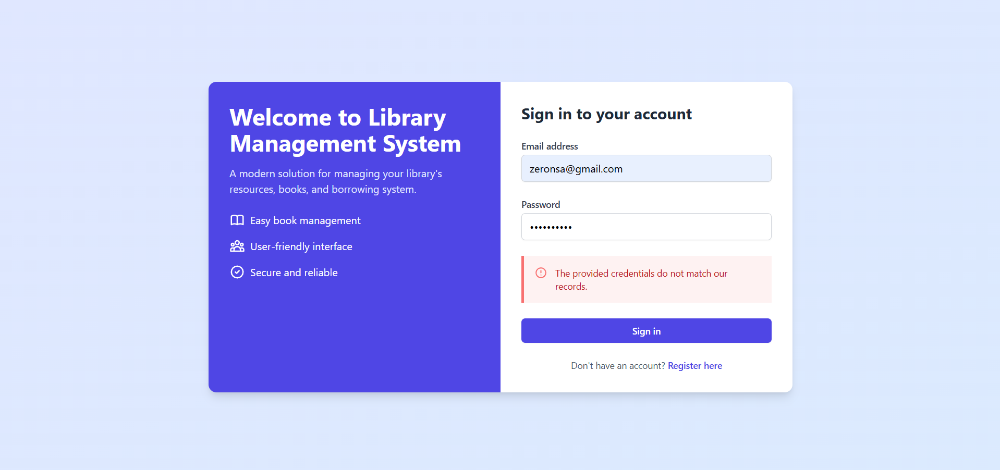
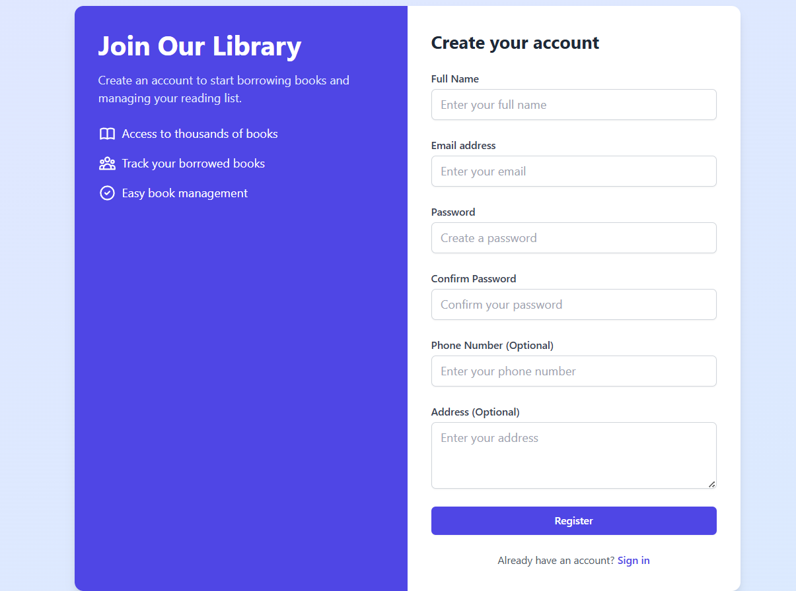

### Dashboard
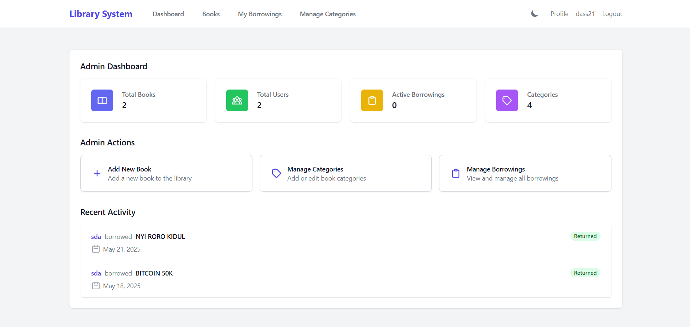
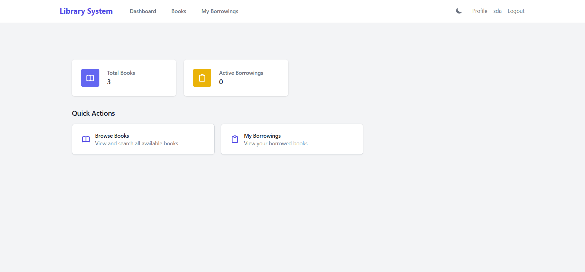

### Book Management
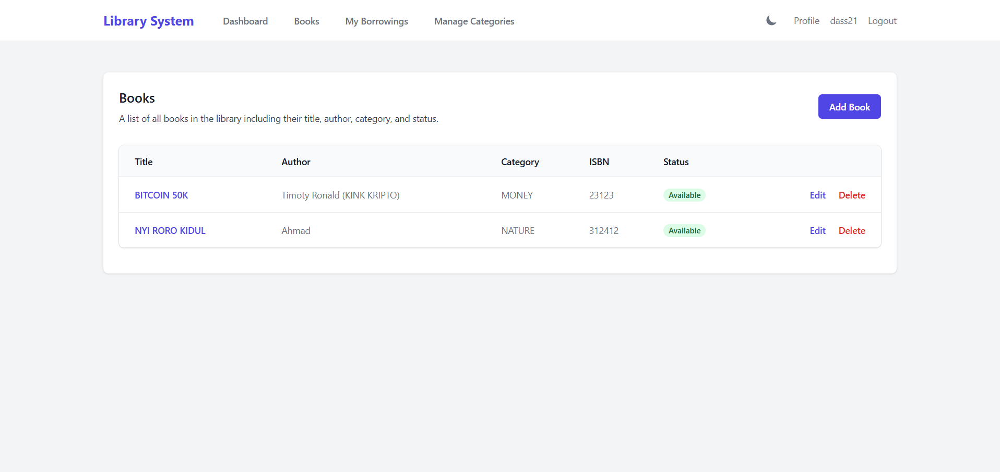
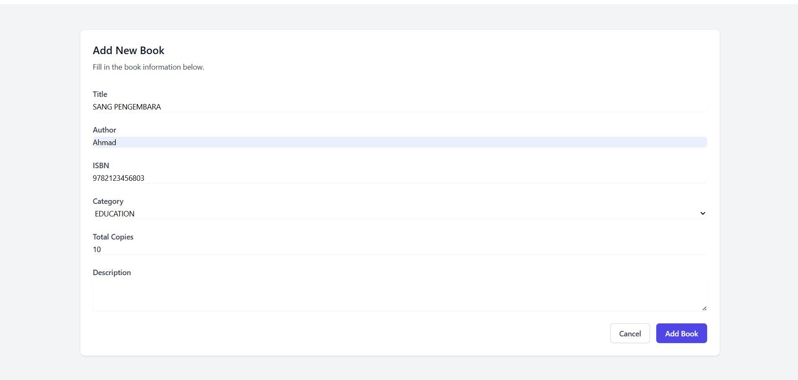
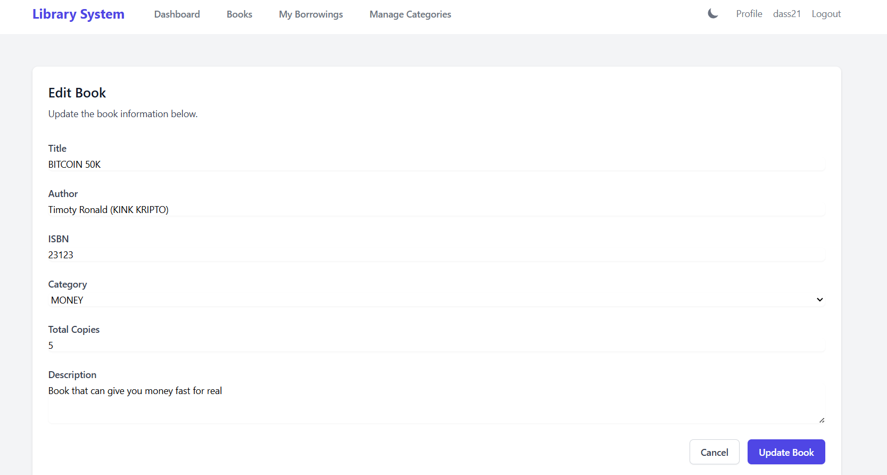

### Borrowing Management
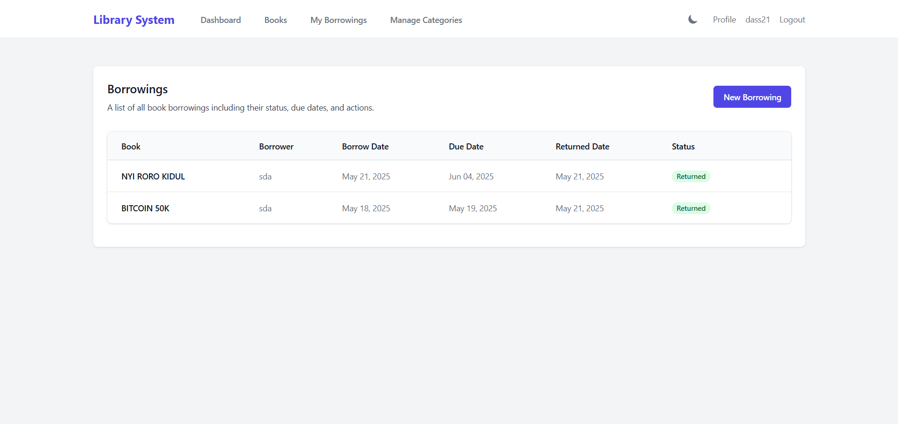
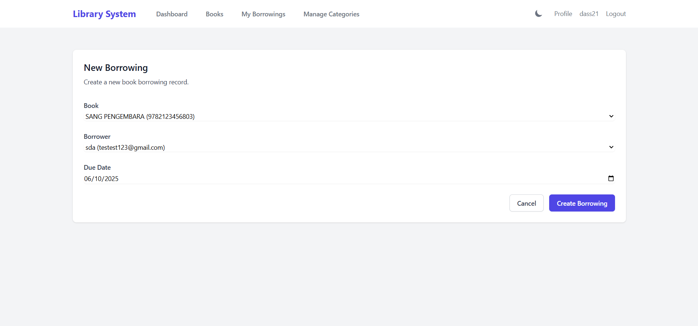
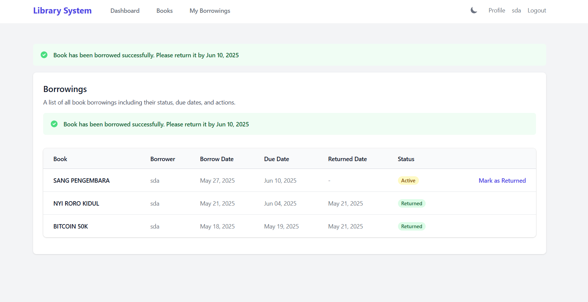

### Category Management
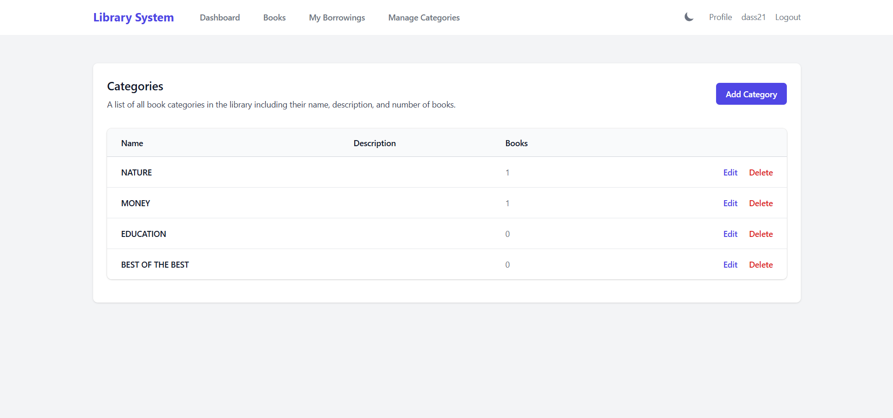
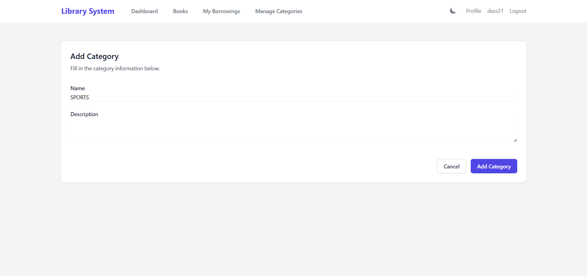

## Database Structure

### Main Tables with Foreign Keys

1. **Books Table**
   - Primary Key: `id` (bigint UNSIGNED)
   - Foreign Keys:
     - `category_id` (references categories table)
   - Other Fields:
     - `title` (varchar(255))
     - `author` (varchar(255))
     - `isbn` (varchar(255), unique)
     - `description` (text, nullable)
     - `total_copies` (int)
     - `available_copies` (int)
     - `created_at` (timestamp)
     - `updated_at` (timestamp)

2. **Borrowings Table**
   - Primary Key: `id` (bigint UNSIGNED)
   - Foreign Keys:
     - `user_id` (references users table)
     - `book_id` (references books table)
   - Other Fields:
     - `borrow_date` (date)
     - `due_date` (date)
     - `return_date` (date, nullable)
     - `status` (enum: 'borrowed', 'returned', 'overdue')
     - `notes` (text, nullable)
     - `created_at` (timestamp)
     - `updated_at` (timestamp)
     - `returned_at` (timestamp, nullable)

3. **Users Table**
   - Primary Key: `id` (bigint UNSIGNED)
   - Other Fields:
     - `name` (varchar(255))
     - `email` (varchar(255), unique)
     - `email_verified_at` (timestamp, nullable)
     - `password` (varchar(255))
     - `role` (enum: 'admin', 'user')
     - `phone` (varchar(255), nullable)
     - `address` (text, nullable)
     - `remember_token` (varchar(100), nullable)
     - `created_at` (timestamp)
     - `updated_at` (timestamp)

### Other Tables
1. **Categories Table**
   - Primary Key: `id` (bigint UNSIGNED)
   - Fields:
     - `name` (varchar(255))
     - `description` (text, nullable)
     - `created_at` (timestamp)
     - `updated_at` (timestamp)

2. **System Tables**
   - `password_reset_tokens`
   - `failed_jobs`
   - `personal_access_tokens`
   - `migrations`

### Key Relationships
1. Books → Categories (Many-to-One)
   - Each book belongs to one category
   - A category can have multiple books

2. Borrowings → Books (Many-to-One)
   - Each borrowing record is associated with one book
   - A book can have multiple borrowing records

3. Borrowings → Users (Many-to-One)
   - Each borrowing record is associated with one user
   - A user can have multiple borrowing records

## CRUD Operations

### Book Management
1. **Create (C)**
   - Form to add new books
   - Fields: title, author, ISBN, category, quantity, description
   - Validation for required fields
   - Success/error messages
   
   

2. **Read (R)**
   - List all books with pagination
   - Search functionality
   - Filter by category
   - View book details
   
   

3. **Update (U)**
   - Edit book information
   - Update quantity
   - Modify category
   - Change book status
   
   

4. **Delete (D)**
   - Remove books from system
   - Soft delete implementation
   - Confirmation dialog
   
   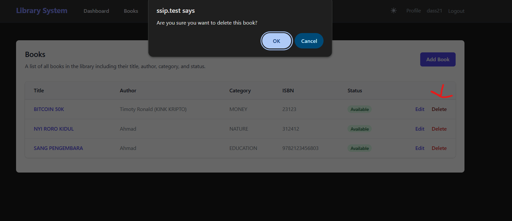

### Borrowing Management
1. **Create (C)**
   - New borrowing record
   - Select book and user
   - Set due date
   - Automatic status update
   
   

2. **Read (R)**
   - View all borrowings
   - Filter by status
   - Search by user/book
   - View borrowing history
   
   

3. **Update (U)**
   - Mark as returned
   - Update due date
   - Change status
   - Add return notes
   
   

4. **Mark As Returned (D)**
   - Remove borrowing records
   - Archive old records
   - Maintain history
   - Mark returned user with date
   
   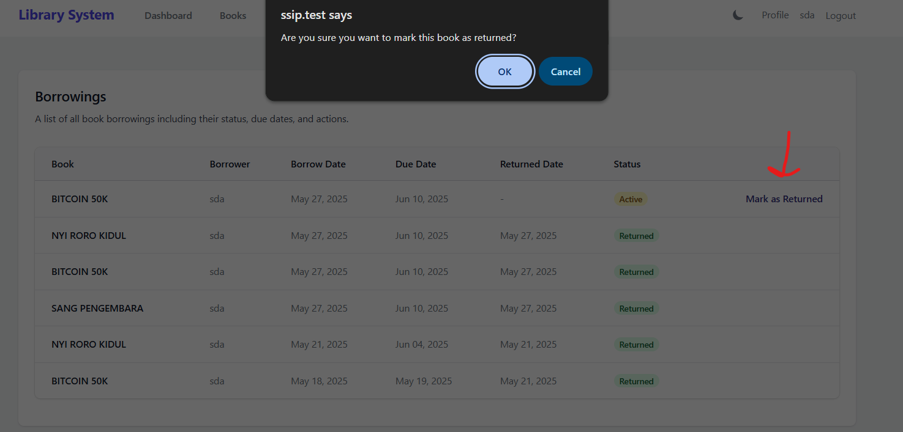

### Category Management
1. **Create (C)**
   - Add new categories
   - Category description
   - Validation
   
   

2. **Read (R)**
   - List all categories
   - View category details
   - Books in category
   
   

3. **Update (U)**
   - Edit category name
   - Update description
   - Modify category details
   
   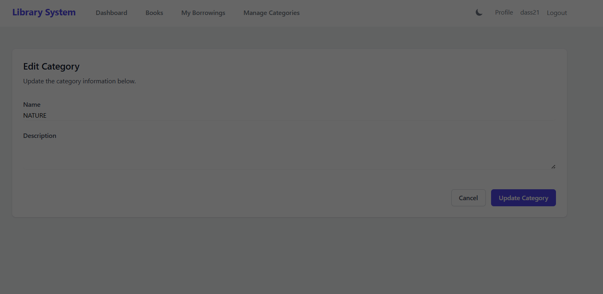

4. **Delete (D)**
   - Remove categories
   - Handle associated books
   
   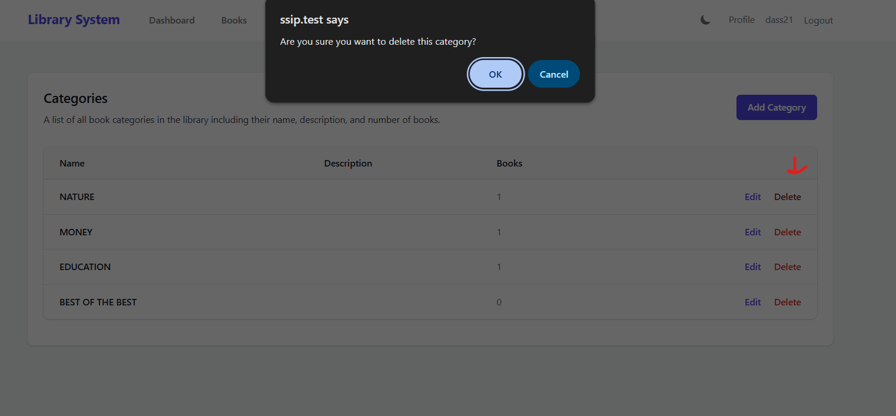

## User Interface

### Authentication
1. **Login**
   - User authentication
   - Remember me functionality
   - Password reset option
   
   

2. **Registration**
   - New user signup
   - Email verification
   - Terms acceptance
   
   

### Dashboard
- Overview statistics
- Recent activities
- Quick actions
- User-specific information


### Responsive Design
- Mobile-friendly layout
- Dark mode support
- Accessible interface

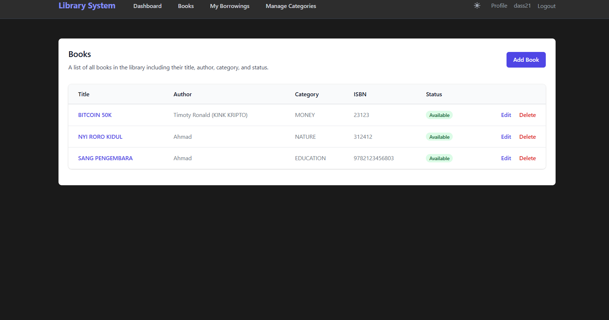

## Business Logic

### User Roles
1. **Administrator**
   - Full system access
   - Manage all books
   - Handle borrowings
   - User management
   - System configuration
   
   

2. **Regular User**
   - View available books
   - Request borrowings
   - Update profile
   
   

### Borrowing Rules
- Maximum books per user
- Due date calculation
- Overdue handling
- Return process

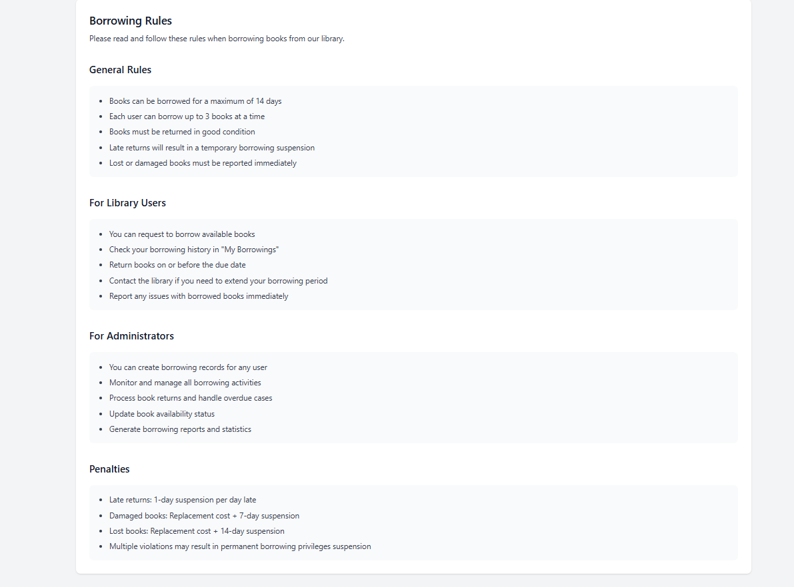

### Notifications
- Due date reminders
- Overdue notifications
- System announcements
- Status updates

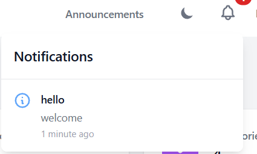

## Installation

1. Clone the repository
```bash
git clone https://github.com/yourusername/library-management.git
cd library-management
```

2. Install dependencies
```bash
composer install
```

3. Create environment file
```bash
cp .env.example .env
```

4. Generate application key
```bash
php artisan key:generate
```

5. Configure your database in `.env`
```env
DB_CONNECTION=mysql
DB_HOST=127.0.0.1
DB_PORT=3306
DB_DATABASE=library
DB_USERNAME=root
DB_PASSWORD=
```

6. Run migrations and seeders
```bash
php artisan migrate --seed
```

7. Start the development server
```bash
php artisan serve
```

## Default Login

### Admin
- Email: admin@example.com
- Password: password

### User
- Email: user@example.com
- Password: password

## Technologies Used

- PHP 8.1
- Laravel 10
- MySQL 8.0
- Bootstrap 5
- JavaScript

## Security Features

- Authentication
- Authorization
- Input validation
- CSRF protection
- XSS prevention
- SQL injection prevention


## License

This project is licensed under the MIT License - see the [LICENSE](LICENSE) file for details.

## Contact

M. Faza Ar Rantisi |
Resya Aniantri Priatna |
Jagad Alit Kalimosodo

Project Link: [https://github.com/KanzeroG/Library-Management](https://github.com/KanzeroG/Library-Management) 
